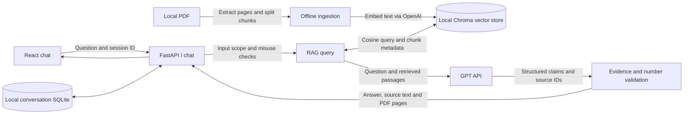
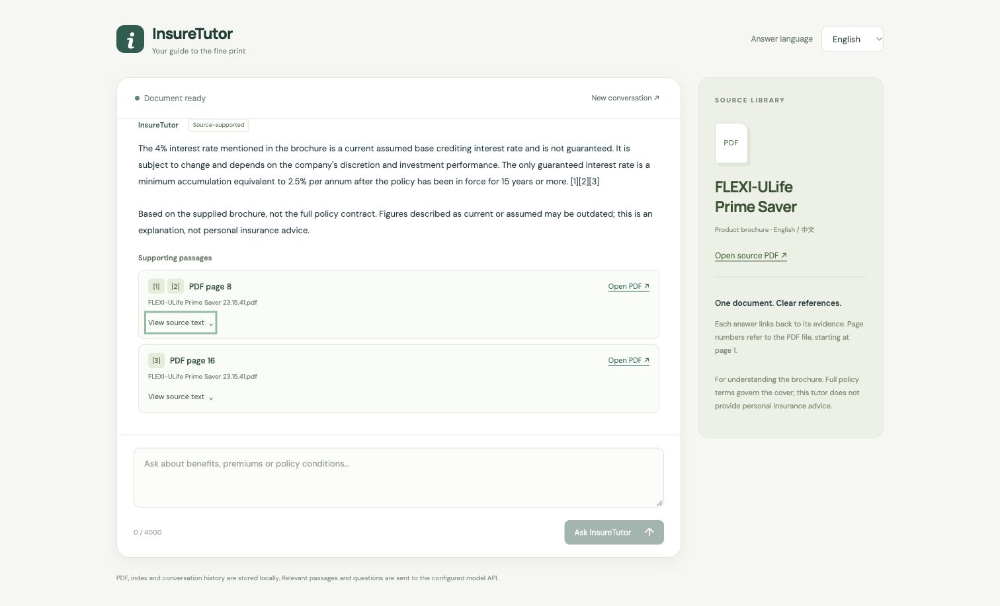

# InsureTutor

A bilingual insurance tutor for the supplied **FLEXI-ULife Prime Saver** brochure.
Ask questions in English, Simplified Chinese, or Traditional Chinese; follow up
in the same conversation; inspect source passages and open their original PDF
pages. Built with React/TypeScript, FastAPI, GPT and OpenAI embeddings.
Source cards group references by PDF page while preserving citation numbers.
Extracted text is collapsed by default and scrolls within a bounded panel;
the original PDF page remains accessible without expanding the text.

## Quick start with Docker

Requires Docker Desktop / Docker Engine with Compose and an OpenAI API key.

```sh
cp .env.example .env
# Edit .env and set MODEL_API_KEY to your OpenAI API key.
docker compose up --build
```

- Chat: <http://localhost:5173>
- API docs: <http://localhost:8000/docs>
- Setup status: <http://localhost:8000/api/health>

Startup automatically extracts the source PDF, builds embeddings, and persists
the index. The initial startup requires API access; unchanged PDFs/settings
reuse the saved index. Source PDFs are mounted read-only. Changes to `.env`
require restarting the backend (`docker compose up -d --force-recreate backend`).
The demo frontend uses the Vite development server.

**Credentials stay on the backend.** PDFs, extracted text, vectors and session
records are stored locally. OpenAI receives document text during embedding,
and questions/retrieved passages during answering. This is not an offline model.
Do not put sensitive documents into the demo without considering this data flow.

Try:

- “Is the 4% interest rate guaranteed?”
- “停止缴付保费会怎样？”
- “保單冷靜期有多久？從何時開始計算？”
- “What is the minimum increase or decrease in sum insured?”
- “What is the guaranteed account value?” → “And when does it apply?”

## Local development

Use Python 3.11+ and Node 22.12+ or Node 24. From the repository root:

```sh
python3 -m venv .venv
source .venv/bin/activate
pip install -r backend/requirements.txt
cp .env.example .env  # Skip if you already configured .env.
# Set MODEL_API_KEY in .env.
uvicorn app.main:app --app-dir backend --reload --port 8000
```

In a second terminal:

```sh
cd frontend
npm ci
npm run dev
```

Vite proxies `/api` to port 8000. Docker sets `BACKEND_URL` to its backend
service. The backend loads the repository `.env`; explicitly exported variables
have precedence. Never commit the real `.env`.

To rebuild manually or inspect extracted records:

```sh
PYTHONPATH=backend .venv/bin/python -m app.rag.ingest --force
# data/processed/pages.json and chunks.json contain inspectable source text.
# Docker equivalent:
docker compose exec backend python -m app.rag.ingest --force
```

Use one ingestion process at a time. Restart after changing source files or
chunk/model settings. Ingestion builds a new Chroma collection, then atomically
updates `data/index/active_collection.json` after all writes succeed. Failed
embedding or storage leaves the previous collection active. Previous collections
are retained locally; this demo does not perform automatic index cleanup.

The fingerprint tracks PDF contents, chunk settings, and embedding configuration.
If extraction, splitting, or vector-processing code changes, use `--force` to
rebuild; this demo does not maintain a separate index version.

The former `data/index/index.sqlite` vector file is no longer read. The first
startup after this migration builds Chroma from the source PDF; later startups
reuse it. The old file can remain as a local backup.

## Architecture





The editable module diagram is in [docs/architecture.drawio](docs/architecture.drawio).
The [assignment](docs/TakeHomeTask-InsureTutor.md) describes the original requirements.
The [design and technology decisions](docs/design-decisions.md) explain the
architecture, selection rationale, RAG parameters and implementation tradeoffs.

```text
backend/app/
├── main.py          API endpoints, PDF serving and startup indexing
├── chat.py          Scope checks, follow-up context and conversation orchestration
├── model_client.py  Provider calls and embeddings
├── guardrails.py    Input rules, evidence validation and known-source conflict check
├── storage.py       SQLite conversation history
├── config.py        Environment settings
├── schemas.py       Typed page, chunk, chat and model-output records
└── rag/
    ├── ingest.py    load_pdf → split_pages → build_index (offline)
    └── query.py     load_index → retrieve → answer_question (online)
frontend/src/        React chat, language selector and expandable source cards
data/raw/            Original source PDF
data/processed/      Extracted pages/chunks (generated; ignored)
data/index/chroma/   Chroma text, vectors and metadata (generated; ignored)
data/index/active_collection.json  Completed collection pointer (generated; ignored)
data/sessions/       Conversation database (generated; ignored)
backend/tests/       Non-network unit/API tests
evals/               Source-grounded API smoke cases and runner
```

### Key decisions

- **Two RAG files.** Preparation and online queries have different lifecycles.
  Splitting and vector-store access remain functions rather than separate
  frameworks or a file per step.
- **Page-preserving chunks.** `pypdf` extracts each page, including the supplied
  PDF's empty-password encryption. LangChain's recursive character splitter
  prefers paragraph/line and Chinese punctuation boundaries. Defaults are
  1,000 **characters** with 150-character overlap; chunks never cross a page.
  Document IDs, filenames and one-based **PDF file pages** stay attached.
- **Local Chroma vector store.** `PersistentClient` stores text, vectors, page
  metadata and embedding/fingerprint settings on disk without another service.
  The application supplies its existing OpenAI embeddings explicitly; Chroma
  does not download or invoke a default embedding model. Chroma queries use
  cosine distance, converted to similarity with `1 - distance`.
  For this tiny corpus, retrieval requests all chunk distances, then adds a
  normalized keyword/Chinese-bigram score weighted by 0.12 before selecting
  primary chunks. This preserves lexical recall rather than introducing a
  new candidate cutoff during the storage migration.
  `TOP_K=5` selects primary chunks, followed by complete matching pages and
  Notes/disclosure pages up to a 17,000-character context budget. This preserves
  footnotes that otherwise sit apart from benefit descriptions. The supplied
  20-page brochure produces 53 chunks with the default settings.
- **Why Chroma.** Its embedded Python API combines document/metadata storage
  and vector querying for this local demo. Qdrant local mode is another valid
  choice. FAISS would still need our own document/metadata persistence;
  pgvector would introduce PostgreSQL, which this project otherwise does not
  need. This is a deployment/simplicity choice, not a performance benchmark.
  See the [Chroma client documentation](https://docs.trychroma.com/reference/python/client),
  [Qdrant client](https://github.com/qdrant/qdrant-client),
  [FAISS](https://github.com/facebookresearch/faiss) and
  [pgvector](https://github.com/pgvector/pgvector).
- **Server-owned citations.** GPT returns claims and source IDs using a strict JSON schema. The backend resolves
  original passages, filenames, PDF page links and citation numbers. It rejects
  unknown IDs, unverifiable quotes, unsupported numeric values and malformed
  answers; rejected output becomes an insufficient-evidence response. Numeric
  formatting such as `4` versus `4.0` is normalized.
- **Conversation context.** Random session IDs isolate local SQLite histories.
  Short/pronominal follow-ups include recent questions and the previous answer
  as context, while factual support must still come from fresh retrieval. New
  conversation clears the UI session. Refreshing starts a new conversation;
  this demo has no user accounts or conversation browser.
- **Layered guardrails.** Input checks reject common prompt injection, secrets,
  fabricated citations, unrelated requests and personal buying recommendations.
  The system prompt treats retrieved text as untrusted data and requires
  evidence-backed claims. A narrowly scoped deterministic comparison flags the
  known bilingual sum-insured-change table conflict. These controls reduce
  failures; they do not prove semantic correctness.

### Source-specific cautions

The brochure is general reference, **not the full policy contract**. PDF page 8
quotes assumed rates as of **January 2022**; they should not be described as
current rates today. The 2.5% condition concerns accumulated account value after
at least 15 years in force, rather than a guaranteed annual credited rate.

On **PDF page 17**, the Chinese minimum increase/decrease row states
USD 5,000 / HKD 40,000 / MOP 400,000; its English counterpart states
USD 5,000 / HKD 400,000 / MOP 40,000. The tutor reports the discrepancy and asks
for insurer confirmation rather than guessing a correction. Detailed benefit
claim document lists and processing times are absent: claims links in the
brochure are not evidence for those details.

### Configuration

| Variable | Default | Purpose |
|---|---|---|
| `MODEL_API_KEY` | empty | OpenAI API key; server-side only |
| `MODEL_PROVIDER` | `openai` | Model API provider |
| `MODEL_BASE_URL` | `https://api.openai.com/v1` | API base URL |
| `CHAT_MODEL` | `gpt-4.1-mini` | Answer model |
| `EMBEDDING_BACKEND` | `openai` | Vector embedding backend |
| `EMBEDDING_MODEL` | `text-embedding-3-small` | Same model for documents and queries |
| `CHUNK_SIZE` / `CHUNK_OVERLAP` | `1000` / `150` | Character splitting settings |
| `TOP_K` | `5` | Primary retrieval count (expanded context can include more) |
| `AUTO_INGEST` | `true` | Build/reuse index on startup |
| `CHAT_MODE` | `llm` | `extractive` displays source passages without chat generation |

OpenAI embeddings still call the API in `extractive` mode. If testing the
optional Claude adapter, use `MODEL_PROVIDER=anthropic`, its native base URL and
chat model, and `EMBEDDING_BACKEND=local` with
`sentence-transformers/paraphrase-multilingual-MiniLM-L12-v2`. This requires a
local embedding-model download/cache and a complete index rebuild; it is not
the default tested submission configuration.

## Verification

```sh
.venv/bin/pip install -r backend/requirements-dev.txt
.venv/bin/python -m pytest backend/tests -q
cd frontend && npm run build
```

With the backend running (uses the configured model API):

```sh
.venv/bin/python evals/run_eval.py
```

The evaluation set covers rates, charges/lapse, cooling-off, withdrawal and
illness conditions, follow-ups, three languages, missing evidence, bilingual
conflicts and misuse. Reports under `evals/results/` are ignored. The automated
checks are smoke checks of statuses, source pages and selected phrases; manually
review source support and all conditions. See [evals/README.md](evals/README.md).

Recorded checks: [docs/verification.md](docs/verification.md).

## Limits and troubleshooting

- This demo supports digitally extractable PDFs, not scanned-document OCR.
  PDF table extraction can lose layout or glyphs. Review source pages when
  tables or translations conflict.
- Retrieval still loads all chunk text and requests all distances for the small
  brochure corpus. A large collection needs bounded Chroma candidates, stronger
  reranking and targeted footnote links. `PersistentClient` is for this local
  demo; shared production deployment should use a server-backed database.
- Deterministic guards and one grounded model call are not a general safety
  verifier. Exact source IDs/quotes and numeric checks establish provenance,
  not logical entailment. Broader adversarial testing remains necessary.
- The interface displays setup/API errors without exposing credentials.
  HTTP 401 usually means a rejected key; 429 may indicate quota/rate limits.
  Configure the key and restart; use `/api/health` to check readiness.
- The demo has no authentication, request rate limiting or session ownership
  checks. Run it locally. Deployment requires those controls and a production
  frontend server.
