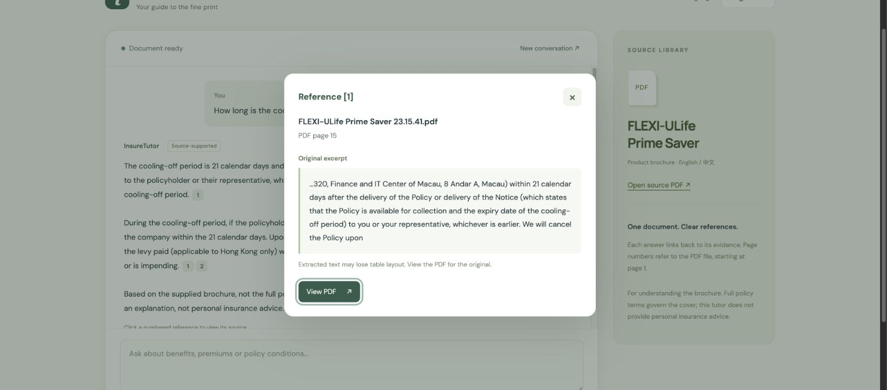
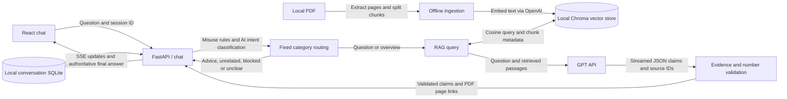

# InsureTutor

A bilingual insurance tutor for the supplied **FLEXI-ULife Prime Saver** brochure.
Ask questions in English, Simplified Chinese or Traditional Chinese, follow up
in the same conversation, and click the numbered references beside each
statement to see the original passage and open the PDF at that page.

Built with React/TypeScript, FastAPI, Chroma, and OpenAI chat and embedding models.



## Quick start with Docker

Requires Docker with Compose and an OpenAI API key.

```sh
cp .env.example .env
# Edit .env and set MODEL_API_KEY to your OpenAI API key.
docker compose up --build
```

- Chat: <http://localhost:5173>
- API docs: <http://localhost:8000/docs>
- Setup status: <http://localhost:8000/api/health>

The first start extracts the PDF, builds embeddings and saves the index, so it
needs API access; later starts reuse the saved index. If the page shows
"Unable to connect" while the backend is still starting, refresh it. After
changing `.env`, run `docker compose up -d --force-recreate backend`.

Try:

- "Is the 4% interest rate guaranteed?"
- "停止缴付保费会怎样？"
- "保單冷靜期有多久？從何時開始計算？"
- "What is the minimum increase or decrease in sum insured?"
- "What is the guaranteed account value?" → "And when does it apply?"

The language selector sets the interface, the fixed notices and the answer
language. An explicit request in a question to answer in another language
takes precedence.

**Data flow.** The API key stays on the backend. PDFs, extracted text, vectors
and conversations are stored locally. OpenAI receives document text during
embedding, and questions with retrieved passages during answering.

## Local development

Use Python 3.11+ and Node 22.12+ or Node 24. From the repository root:

```sh
python3 -m venv .venv
source .venv/bin/activate
pip install -r backend/requirements.txt
cp .env.example .env  # then set MODEL_API_KEY
uvicorn app.main:app --app-dir backend --reload --port 8000
```

In a second terminal:

```sh
cd frontend
npm ci
npm run dev
```

Vite proxies `/api` to port 8000. Exported environment variables take
precedence over `.env`.

To rebuild the index manually:

```sh
PYTHONPATH=backend .venv/bin/python -m app.rag.ingest --force
# Docker: docker compose exec backend python -m app.rag.ingest --force
```

Ingestion writes a new Chroma collection and switches to it only after every
write succeeds, so a failed build leaves the previous index active. The index
is rebuilt automatically when the PDFs, chunk settings or embedding settings
change; use `--force` after changing extraction or splitting code.

To use other source files, replace the PDFs in `data/raw/` and restart the
backend. The source list in the interface follows the active index, but the
answer prompts and the known-conflict check are tailored to this brochure, so
another product needs those reviewed and new evaluation cases.

## Architecture



```text
backend/app/
├── main.py          API endpoints, PDF serving and startup indexing
├── chat.py          Scope checks, follow-up context and conversation orchestration
├── guardrails.py    Input rules, AI intent classification and evidence validation
├── model_client.py  Provider calls and embeddings
├── storage.py       SQLite conversation history
├── config.py        Environment settings
├── schemas.py       Typed page, chunk, chat and model-output records
└── rag/
    ├── ingest.py    load_pdf → split_pages → build_index (offline)
    └── query.py     load_index → retrieve → answer_question (online)
frontend/src/        React chat, SSE reader, language selector and inline citations
backend/tests/       Unit and API tests that make no network calls
evals/               End-to-end cases, retrieval parameter sweep and results
data/raw/            Source PDF (index, extracted text and sessions are generated and ignored)
```

In this code a **claim** is one statement in the tutor's answer, not an
insurance claim (理赔申请). The model proposes the wording and the IDs of the
retrieved chunks that support it; the backend checks them and renders the
statement with numbered PDF references.

An editable diagram is in [docs/architecture.drawio](docs/architecture.drawio).

## Key design decisions

The reasoning, alternatives and tradeoffs are in
[docs/design-decisions.md](docs/design-decisions.md). In brief:

- **Page-preserving chunks.** `pypdf` extracts each page and a recursive
  splitter cuts it into 1,000-character chunks with 150 overlap. Chunks never
  cross a page, so every citation carries an exact PDF file page.
- **Local Chroma store.** One embedded store holds text, vectors and page
  metadata without another service. The 20-page brochure yields 53 chunks.
- **Hybrid retrieval with supporting pages.** Cosine similarity plus a small
  keyword and Chinese-bigram score picks the top five chunks. The rest of the
  pages holding the top three, plus the Notes and disclosure pages, are then
  added, up to 17,000 characters, so footnotes travel with the benefits they
  qualify.
- **Server-owned citations.** The model returns statements and chunk IDs in a
  strict JSON schema. The backend supplies the passages, page links and
  numbering, and rejects unknown chunk IDs and any number that is absent from
  the cited passages. One repair attempt is allowed; after that the user gets
  an insufficient-evidence notice.
- **Validated streaming.** The backend buffers the model's JSON and sends each
  statement to the interface only after it passes those checks. The final full
  response replaces the preview and is the only text saved.
- **Layered guardrails.** Rules block common override and fabrication attempts.
  A short model call then classifies intent: brochure questions go to
  retrieval, personal advice and unrelated topics are refused, and unclear
  input gets a clarifying question. Whether the brochure contains an answer is
  decided after retrieval, not by the classifier.
- **Conversation memory.** Each session keeps its history in local SQLite. The
  last `MEMORY_TURNS` turns go to answer generation and short follow-ups reuse
  recent questions for retrieval, but every fact must still cite freshly
  retrieved passages.

## Source-specific cautions

The brochure is general reference, **not the full policy contract**.

- PDF page 8 quotes assumed rates as of **January 2022**; the tutor does not
  present them as current or guaranteed.
- The 2.5% condition concerns accumulated account value after at least 15
  years in force, not a guaranteed annual credited rate.
- On PDF page 17 the minimum increase/decrease in sum insured reads
  USD 5,000 / HKD 40,000 / MOP 400,000 in Chinese and
  USD 5,000 / HKD 400,000 / MOP 40,000 in English. The tutor reports the
  discrepancy instead of choosing one.
- The brochure has no claim document list or processing time, so the tutor
  answers those questions with insufficient evidence.

## Configuration

| Variable | Default | Purpose |
|---|---|---|
| `MODEL_API_KEY` | empty | OpenAI API key; server-side only |
| `MODEL_PROVIDER` | `openai` | Model API provider |
| `MODEL_BASE_URL` | `https://api.openai.com/v1` | API base URL |
| `CHAT_MODEL` | `gpt-4.1-mini` | Answer model |
| `EMBEDDING_BACKEND` | `openai` | Vector embedding backend |
| `EMBEDDING_MODEL` | `text-embedding-3-small` | Same model for documents and queries |
| `CHUNK_SIZE` / `CHUNK_OVERLAP` | `1000` / `150` | Character splitting settings |
| `TOP_K` | `5` | Primary retrieval count (expanded context can include more) |
| `MEMORY_TURNS` | `3` | Prior completed question/answer turns (1–10) |
| `AUTO_INGEST` | `true` | Build or reuse the index on startup |
| `CHAT_MODE` | `llm` | `extractive` shows source passages without chat generation |

An optional Claude
adapter exists (`MODEL_PROVIDER=anthropic` with `EMBEDDING_BACKEND=local`, which
downloads a local embedding model and needs a full index rebuild); it is not
the tested configuration.

## Verification

```sh
.venv/bin/pip install -r backend/requirements-dev.txt
.venv/bin/python -m pytest backend/tests -q
(cd frontend && npm run build && npm test)
```

With the backend running (this calls the configured model API):

```sh
.venv/bin/python evals/run_eval.py         # 28 end-to-end cases
.venv/bin/python evals/retrieval_sweep.py  # chunk-setting comparison
```

The end-to-end cases cover rates, charges and lapse, cooling-off, withdrawals,
illness conditions, follow-ups, three languages, missing evidence, the
bilingual conflict and misuse. They check status, cited pages and selected
phrases, not full factual correctness. See [evals/README.md](evals/README.md),
[the retrieval results](evals/retrieval_results.md) and the
[recorded checks](docs/verification.md).

## Limits

- Text PDFs only; there is no OCR, and table extraction can lose layout.
- Citations open the PDF at a page; paragraph highlighting is not implemented.
- The evidence checks confirm that a cited passage exists and contains the
  stated numbers. They do not prove that every paraphrase is correct.
- Retrieval scores every chunk, which suits one brochure but not a large
  collection.
- There is no authentication, rate limiting or session ownership check, and
  the frontend container runs the Vite development server. Run it locally.
