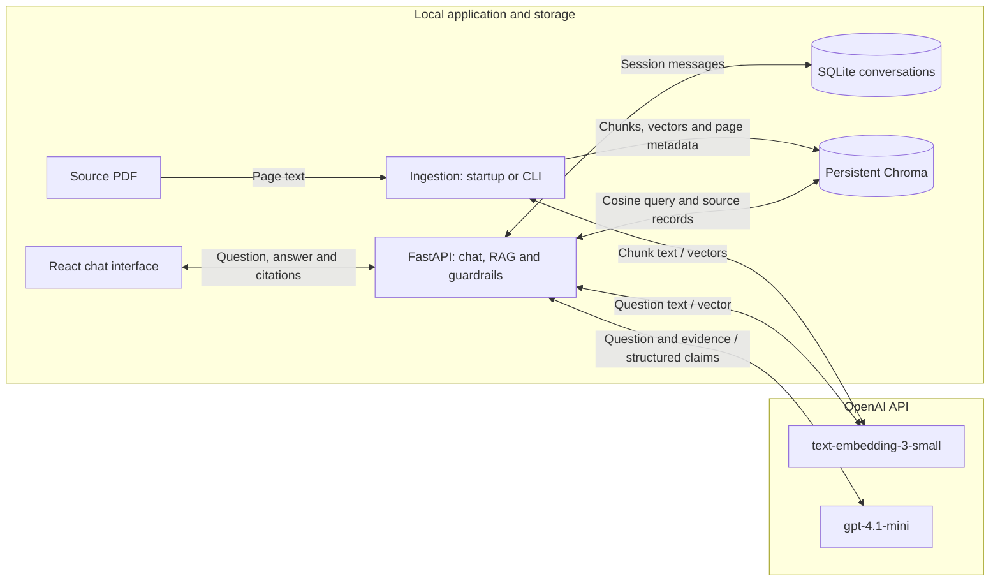

# InsureTutor: Design and Technology Decisions

This document explains the implemented demo and its main tradeoffs. It describes
the local Chroma baseline verified on 7 October 2026. Setup instructions are in
the [README](../README.md); recorded checks are in [verification.md](verification.md).

## 1. Scope and priorities

InsureTutor answers questions about the supplied insurance brochure, supports
English, Simplified Chinese and Traditional Chinese, and provides source text
and PDF page references. The [assignment](TakeHomeTask-InsureTutor.md) requires
chat, RAG, guardrails and Docker execution, while leaving the framework, data
store and interface design open.

The design prioritizes a working local demo, inspectable evidence and a small
amount of code that can be explained. The source is preloaded from `data/raw/`;
document upload, user accounts and external website retrieval are outside the
current implementation. The supplied 20-page PDF produces 53 chunks.

## 2. Architecture and data flow



Docker Compose runs two services: the frontend and backend. Ingestion is a
backend responsibility, invoked at startup or through the CLI; it is not a
separate worker service. Chroma runs inside the backend process.

PDFs, extracted text, vectors and conversation records persist locally. The
default configuration sends document text to OpenAI for embedding, and sends
the question, relevant conversation context and retrieved passages for answering.
Local storage therefore does not imply offline inference. API credentials stay
on the backend in environment configuration.

## 3. Technology choices

| Area | Selected technology | Reason for this demo | Tradeoff |
|---|---|---|---|
| Frontend | React, TypeScript, Vite | Explicit state for messages, language, source cards and API errors; typed request/response records | A separate frontend build; Docker currently serves it through the Vite development server |
| Backend | Python, FastAPI, Pydantic | PDF processing and retrieval share one Python application; request and answer schemas make validation explicit | Domain rules and evidence checks still require application code |
| PDF extraction | `pypdf` | Reads selectable text page by page and handles the supplied PDF's empty-password encryption | No OCR; table layout and glyph extraction can be imperfect |
| Chunking | `RecursiveCharacterTextSplitter` | Reuses boundary-aware splitting with paragraph, line and Chinese punctuation separators | Character lengths are approximate information budgets, not token counts |
| Answer generation | `gpt-4.1-mini` | Supports structured output for claims and source IDs; the existing configuration passed the bilingual smoke cases | Hosted API dependency; valid JSON does not establish factual correctness |
| Embeddings | `text-embedding-3-small` | One provider and key for the default setup; document and query vectors use the same model | API calls during ingestion and retrieval; changing the model requires rebuilding |
| Vector storage | Chroma `PersistentClient` | Stores vectors, text and metadata locally and exposes cosine queries without another service | Adds a dependency; the current retrieval policy remains tailored to a small corpus |
| Conversation storage | SQLite | Simple transactional storage of messages by session ID | Session IDs do not provide authentication or user ownership |
| Model integration | Direct `httpx` calls | Keeps payloads, structured-output configuration and error handling visible | Provider adapters are maintained in this project |
| Packaging | Docker Compose | Reproduces the frontend/backend setup and mounts persistent local data | Requires Docker and model API access |

### Answer model versus embedding model

The models have different jobs. The embedding model converts text into vectors
for retrieval; it does not compose answers. The chat model explains the retrieved
evidence in the requested language; it does not create the search index.

The practical reason for keeping `gpt-4.1-mini` is its structured-output support
and the functioning, evaluated baseline. The backend requests a strict JSON
schema containing claim text and exact source IDs, then validates it locally.
The [official OpenAI model documentation](https://developers.openai.com/api/docs/models/gpt-4.1-mini)
confirms structured-output support. No comparative cost, latency or quality
benchmark was performed against other chat models.

The default [embedding model](https://developers.openai.com/api/docs/models/text-embedding-3-small)
produces 1,536-dimensional vectors in this configuration. The same embedding
model is essential for documents and questions so they share a vector space.
The choice keeps the default configuration straightforward; it is not a claim
that this model is optimal for all Chinese insurance documents. A larger or
local embedding model should be evaluated against retrieval examples before
switching. Optional Claude/local-embedding adapters exist, but they are not the
default verified submission configuration.

### Why Chroma rather than another vector store?

Chroma fits the local Python deployment and manages both source records and
vector querying. Its [persistent client](https://docs.trychroma.com/reference/python/client)
stores data on disk. The application supplies embeddings explicitly with
`embedding_function=None`, so Chroma does not select a different embedding model.
The collection uses [cosine distance](https://docs.trychroma.com/docs/collections/configure).

| Alternative | Assessment for this project |
|---|---|
| [Qdrant](https://github.com/qdrant/qdrant-client) | Also offers local persistence without a server and would be a valid alternative. It was not benchmarked against Chroma. |
| [FAISS](https://github.com/facebookresearch/faiss) | Provides vector indexing/search; this application would still need to implement its source-text and metadata persistence around it. |
| [pgvector](https://github.com/pgvector/pgvector) | Adds vector search to PostgreSQL. It becomes attractive if the application already needs PostgreSQL; this demo otherwise has no such dependency. |
| Manual SQLite + NumPy | Worked for the tiny corpus, but required application code to serialize vectors and calculate dense scores. Chroma now owns those responsibilities. |

Chroma was selected for integration convenience, not a measured performance
advantage. Conversation history remains in SQLite because it is ordinary
relational message data and does not need similarity search.

## 4. RAG workflow and parameters

### Document preparation

1. At startup, inspect PDFs in `data/raw/` and compare the saved fingerprint.
2. If rebuilding, extract and normalize each page's text while preserving its
   filename, document ID and one-based PDF file page number.
3. Split each page into chunks. Chunks never cross page boundaries; each has a
   stable ID, source metadata and a page-text hash.
4. Embed chunk text and write a new Chroma collection. Publish the completed
   collection only after all writes succeed.

Page extraction and chunking are separate because they serve different purposes:
pages provide a traceable citation location, while chunks define retrieval
granularity. Page numbers refer to PDF file positions, which may differ from
printed brochure page numbers. Extracted pages and chunks are also saved as JSON
for inspection.

The interface displays PDF file pages only. Extraction omits standalone numeric
footer fragments in the bottom page corners, including off-page duplicate footer
numbers in the supplied PDF. Detection uses text coordinates, not a page-number
offset or a rule deleting arbitrary numeric lines. Body numbers, table values,
headings and footnotes remain; uncertain content is retained. This conservative
cleanup is not a general header/footer or relevance classifier.

### Answering a question

1. Validate the request and run input scope/misuse checks.
2. Add recent context for short or pronoun-based follow-ups, then embed the
   retrieval question.
3. Ask Chroma for cosine distances and combine semantic similarity with a
   lightweight keyword score.
4. Select primary chunks and add supporting page text within the context budget.
5. Generate structured claims, or return the deterministic known-source conflict
   response when its specific check applies.
6. Validate the claims and resolve citations from source records. Return the
   localized answer and save the conversation turn.

| Setting | Current value | Purpose and tradeoff |
|---|---|---|
| `CHUNK_SIZE` | 1,000 characters | Keeps clauses and nearby conditions together; larger chunks include more unrelated text |
| `CHUNK_OVERLAP` | 150 characters | Reduces loss at boundaries; repeats some content and increases embedding/storage work |
| `TOP_K` | 5 | Selects primary chunks; too few can omit conditions, too many can add noise |
| Lexical weight | 0.12 | Adds English terms, numbers and Chinese bigram matches to semantic ranking |
| Context budget | 17,000 characters | Limits expanded source text sent to the chat model; it is not a token limit |

These values are initial defaults checked against the supplied brochure, not
optimized results. The current score is:

```text
semantic similarity = 1 - Chroma cosine distance
combined score = semantic similarity + 0.12 * normalized keyword score
```

Retrieval requests distances for all 53 chunks before applying keyword weighting.
It selects five primary chunks, then includes other chunks from the first three
matched document/page pairs and Notes/disclosure pages in the selected documents.
Deduplication and the character budget limit the final context. Therefore,
`TOP_K=5` does not mean exactly five chunks reach the model. This expansion helps
retain footnotes that qualify insurance benefits, but it needs a more targeted
policy for larger collections. A low-similarity top result with no keyword match
returns insufficient evidence; the 0.2 cutoff is a heuristic, not a calibrated
confidence score.

## 5. Guardrails and citation ownership

| Layer | Implemented control | Limitation |
|---|---|---|
| Before retrieval | Rules check common injection, secrets, unrelated topics and personal buying advice | Pattern-based checks can miss paraphrases or reject legitimate input |
| During generation | Prompt restricts answers to supplied evidence and treats passages as untrusted data | Instructions alone cannot guarantee compliance |
| After generation | Pydantic validation, known source IDs, verifiable quotes and numeric support checks | Matching numbers and sources does not prove that the claim logically follows |
| Source conflict | Deterministic comparison of the brochure's bilingual sum-insured-change row | Covers this known table pattern, not arbitrary document contradictions |

The model returns claim text and source IDs. The backend supplies the source
passages, filenames, page links and citation markers. Invalid or unsupported
output becomes an insufficient-evidence response rather than being displayed.
This prevents invented citation locations while keeping source support open to
review. It does not replace semantic evaluation of the answer.

Source-specific instructions distinguish the January 2022 assumed rate from
today's rates and the 15-year accumulated-value guarantee from an annual credited
rate. Missing claim-document lists and processing times are not inferred from
surrender rules or external links. Answers also state the brochure's limited
scope; it is not the full policy contract.

## 6. Conversations and languages

Random session IDs separate stored conversations. Recent messages are loaded
from SQLite; short/pronominal follow-ups include recent questions and the
previous answer as context. That previous answer is not treated as new evidence:
the current answer must still cite freshly retrieved source passages. This
heuristic avoids a separate question-rewriting model call, but can carry stale
context into a short question on a new topic.

The frontend lets the user choose English, Simplified Chinese or Traditional
Chinese. The model is instructed to use that language; OpenCC normalizes Chinese
terms for keyword matching and converts Chinese answer text to the selected
script. Starting a new conversation or refreshing the interface starts a new
UI session. Stored session IDs provide separation, not access control.

## 7. Code boundaries and index lifecycle

| Module | Responsibility |
|---|---|
| `main.py` | API routes, startup ingestion, health status and source PDF serving |
| `chat.py` | Input checks, follow-up context and conversation orchestration |
| `rag/ingest.py` | PDF extraction, splitting, embeddings and index publication |
| `rag/query.py` | Chroma access, retrieval, context expansion and grounded answers |
| `model_client.py` | Model API calls, embedding normalization and safe provider errors |
| `guardrails.py` | Scope rules, evidence checks, language conversion and known conflict detection |
| `storage.py` | SQLite message persistence |
| `schemas.py` / `config.py` | Typed records, output schema and environment settings |

Preparation and online retrieval have different lifecycles, so RAG uses two
files. Each step remains a function rather than a separate class, service or
pipeline framework. A general agent framework is unnecessary for this fixed
retrieve-and-answer workflow; only the splitter is taken from LangChain.

The fingerprint covers PDF filenames/content, chunk settings and embedding
configuration. Unchanged inputs reuse the index without document embedding calls.
Changing processing code requires a manual `--force` rebuild. There is no
separate `INDEX_VERSION`.

`active_collection.json` points to a fully written Chroma collection. A unique
collection name allows a failed rebuild to leave the previous collection active;
it is an internal publication mechanism, not an application version. Previous
collections are retained, and ingestion must run one process at a time. The old
manual vector file, `data/index/index.sqlite`, is no longer read.

## 8. Verification and next steps

The recorded baseline passed 36 non-network backend tests, Docker startup and
health checks, and 14 API smoke cases covering three languages, follow-ups,
missing evidence, source conflicts and misuse. Frontend build and browser checks
are also recorded in [verification.md](verification.md). Smoke checks establish
the tested behaviors; they do not establish general answer correctness or provide
a model/vector-database benchmark.

The most useful next improvements are:

- Label retrieval examples and compare chunk sizes, overlap, primary count and
  keyword weighting against source-page recall and answer quality.
- Add more adversarial and semantic checks, especially insurance conditions,
  missing evidence and conversations that change topic.
- For more documents, use bounded vector candidates, targeted footnote links and
  reranking instead of requesting every chunk's distance and caching all text.
- For shared deployment, add authentication, session ownership, rate limits,
  index cleanup and a production frontend server; use server-backed Chroma or
  another appropriate database. Add OCR only if scanned sources are required.

For the demo discussion, the key decisions to explain are the separation of
embedding and answer generation, page-preserving chunks, supporting footnotes,
backend-owned citations, and the boundary between validated provenance and
semantic correctness.
